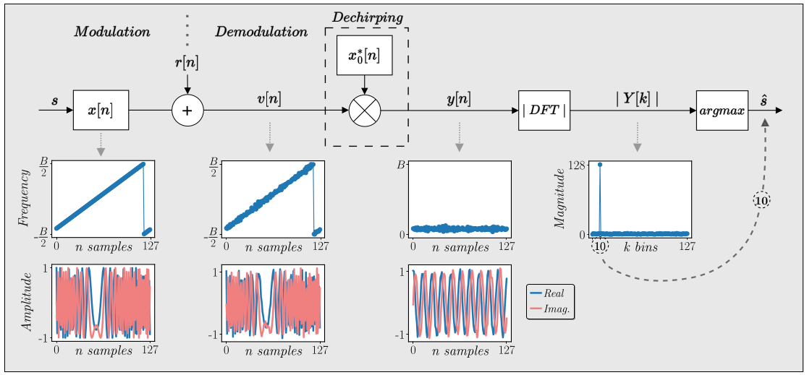
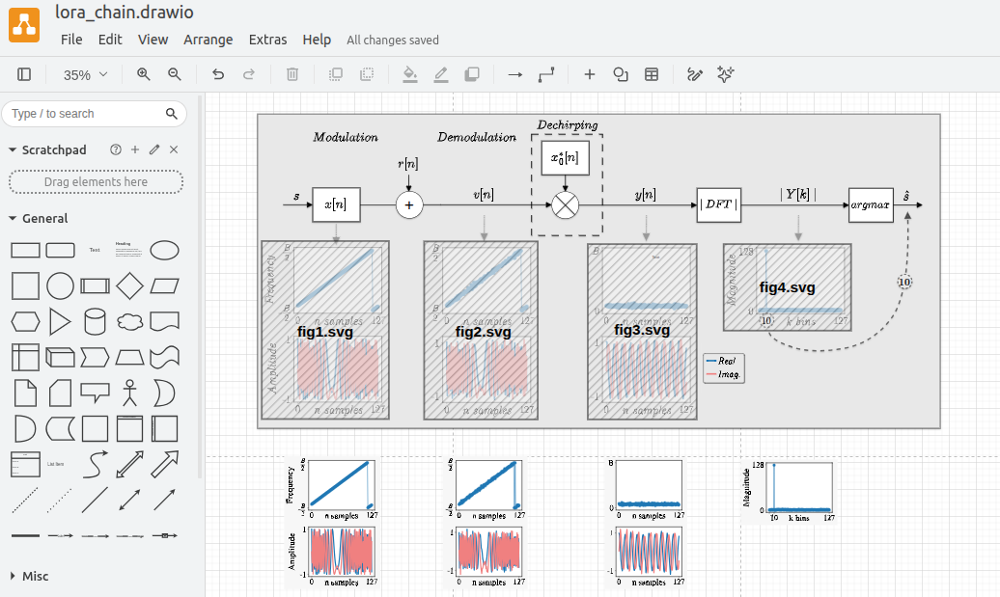

# Reproducing LoRa modulation/demodulation

This file shows the steps to reproduce fig.2:  

1. Creates a venv and install required packages
```bash
    python3 -m venv venv 
    source venv/bin/activate 
    pip install -r requirements.txt
```
2. Open `lora_chain.py` Specify a folder to save the  `.sgv` figures 
```python
image_folder="/home/ederson/Desktop/figures/" # linux
```
3. Run the code
   
```bash
python lora_chain.py 
```
4. Open the drawio model file: `doppler_chain.drawio`, activate `Mathematical Typeseting` on the `Extra` menu and import the `.sgv` figures.

