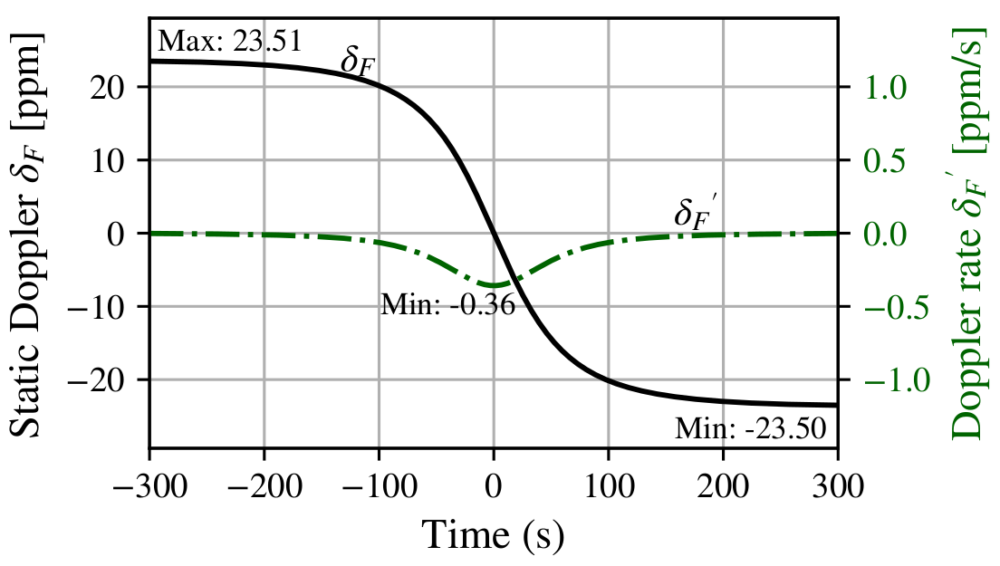

This file shows the steps to reproduce  fig.3:  


<p align="center">

</p>
<p align="center"><em>Fig. 3:Example of δF (t) and δF(t) curves for a satellite with
H=500 km and 10 minutes pass, with ≈ ±23.5 ppm and 0.36 ppm/s
maximum values.


1. Creates a venv and install required packages  

```bash
    python3 -m venv venv 
    source venv/bin/activate 
    pip install -r requirements.txt
```
2. Open `src/main.py` and specify a folder to save the  the figure 
```python
image_folder="/home/ederson/Desktop/figures/" 
```
3. Run the code
   
```bash
python main.py 
```
