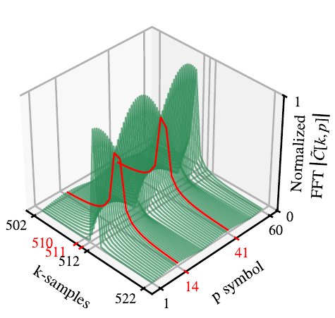

### Doppler impact in a sequence of symbols (packet).

This file shows the steps to reproduce the Doppler impact on a symbol sequence, reproducing the fig.5: 

<p align="center">

</p>

<p align="center"><em>Occurrence the errors (one unit symbol shift represented by the red markers) due to Doppler in a symbol sequence, with SF=11 and B=125 kHz. The k-axis was truncated for illustration..</em></p>

1. Creates a venv and install required packages: 

```bash
    python3 -m venv venv 
    source venv/bin/activate 
    pip install -r requirements.txt
```

2. Open `src/main.py` and specify a folder to save the figure:

```python
image_folder="/home/ederson/Desktop/figures/" 
```

3. Run the code:  
  
```bash
python main.py 
```