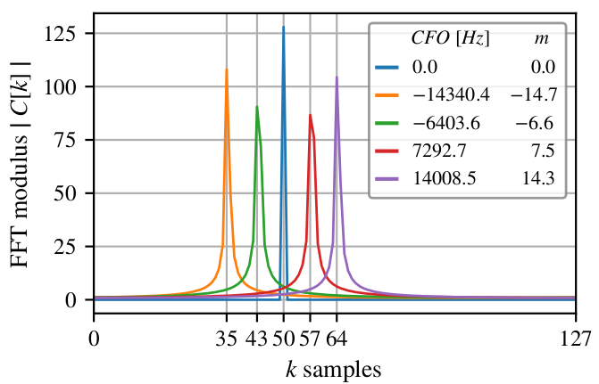

### Impact of a frequency shift on a LoRa symbol

This file shows the steps to reproduce the frequency shift effect on a LoRa symbol, shown in fig.4:  
<p align="center">

</p>
<p align="center"><em>Fig. 4. FFT magnitude of dechirped signal on receiver, for five
transmissions of symbol s = 50. The bin correspondent to the FFT
energy peak changes ⌊m⌉ units accordingly to each CFO value.</em></p>


1. Creates a venv and install required packages  

```bash
    python3 -m venv venv 
    source venv/bin/activate 
    pip install -r requirements.txt
```
2. Open `src/main.py` and specify a folder to save the figure. 
```python
image_folder="/home/ederson/Desktop/figures/" 
```
3. Run the code
   
```bash
python main.py 
```
