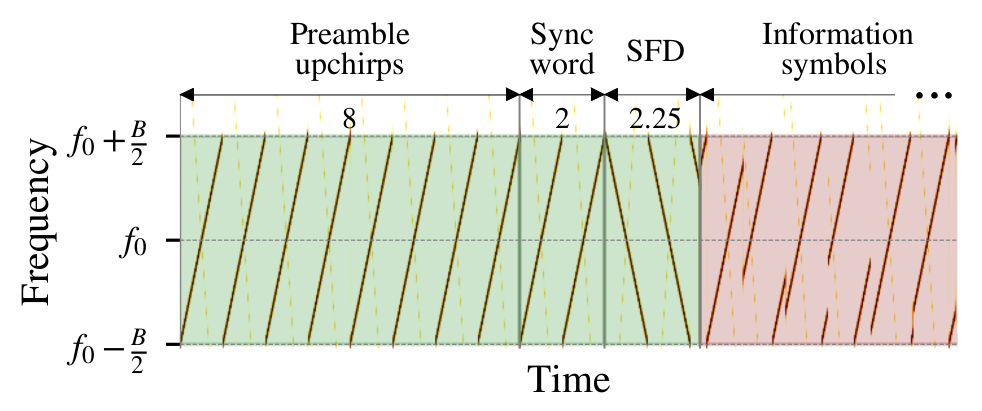

### Reproducing LoRa modulation/demodulation

This file shows the steps to reproduce the LoRa packet format, shown fig.1:  
<p align="center">

</p>
<p align="center"><em>Fig. 1. LoRa packet format highlighting preamble and information
symbols. Extracted from a real signal with f0=436 MHz, SF=11 and
B=250 kHz..</em></p>


1. Creates a venv and install required packages  

```bash
    python3 -m venv venv 
    source venv/bin/activate 
    pip install -r requirements.txt
```
2. Open `src/main.py` and specify a folder to save the  `.sgv` figures 
```python
image_folder="/home/ederson/Desktop/figures/" 
```
3. Run the code
   
```bash
python main.py 
```
